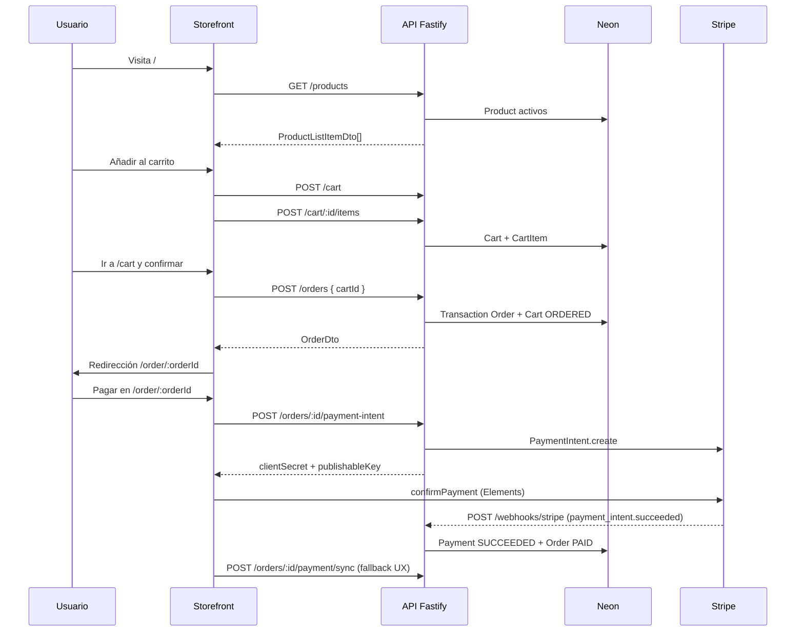

# Arquitectura — Ecommerce Starter Kit

Documento vivo que describe **cómo está construido el sistema hoy** y **hacia dónde evoluciona**. Cualquier cambio relevante en código, contratos, CI o despliegue debe reflejarse aquí (ver [docs/DOCUMENTATION.md](docs/DOCUMENTATION.md)).

## Principios

| Principio | Aplicación en este repo |
|-----------|-------------------------|
| Monorepo desacoplado | Apps y packages con contratos explícitos (`@packages/types`, `@packages/contracts`). |
| Modular monolith | Un runtime API (Fastify); dominios separados por carpetas y ownership, no por microservicios prematuros. |
| Contratos primero | OpenAPI v1 + DTOs compartidos; la implementación no puede divergir sin actualizar contrato y docs. |
| Evolución por evidencia | Extracción a servicios dedicados solo con SLO, throughput u ownership justificados (ver [docs/roadmap.md](docs/roadmap.md)). |
| EU-first en datos | PostgreSQL en Neon (región EU); secretos y URLs fuera del repositorio. |

## Vista del sistema

```mermaid
flowchart LR
  subgraph client [Cliente]
    SF[Storefront Next.js]
  end

  subgraph api [API modular]
    FF[Fastify]
    BC[Bounded contexts]
    FF --> BC
  end

  subgraph data [Datos]
    Neon[(Neon Postgres EU)]
  end

  subgraph contracts [Contratos]
    OAS[OpenAPI v1]
    TYP[@packages/types]
    EVT[Eventos de dominio]
  end

  SF -->|REST JSON| FF
  FF -->|Prisma + adapter Neon| Neon
  FF -.->|implementa| OAS
  SF -.->|consume DTOs| TYP
  BC -.->|publica en el futuro| EVT
```

## Estructura del monorepo

```
ecommerce-starter-kit/
├── apps/
│   ├── api/          # Fastify + Prisma (fuente de verdad de negocio)
│   └── storefront/   # Next.js App Router (UI y llamadas REST al API)
├── packages/
│   ├── types/        # DTOs TypeScript compartidos
│   ├── contracts/    # OpenAPI v1 + eventos de dominio
│   └── config/       # Configuración compartida (reservado)
├── docs/
│   ├── roadmap.md
│   └── DOCUMENTATION.md
├── .github/workflows/
│   ├── ci.yml
│   └── neon_workflow.yml
└── ARCHITECTURE.md   # Este archivo
```

**Runtime previsto (no implementado aún):** `apps/worker` (BullMQ + Redis) para webhooks, emails y tareas asíncronas.

## Bounded contexts

Los dominios están declarados en `apps/api/src/bounded-contexts/` y modelan el límite de responsabilidad. La implementación HTTP actual vive en `apps/api/src/index.ts` de forma centralizada; la extracción a módulos por contexto es el siguiente paso estructural.

| Contexto | Responsabilidad | Estado actual |
|----------|-----------------|---------------|
| `catalog` | Productos, precio, disponibilidad | `GET /products` + modelo `Product` |
| `cart` | Carrito activo e ítems | `POST/GET /cart`, items CRUD |
| `orders` | Pedidos desde carrito | `POST/GET /orders` |
| `checkout` | Orquestación de pago y cierre | Integrado vía página de orden + Payment Element |
| `payments` | Cobros, idempotencia, webhooks | PaymentIntent, webhook Stripe, modelo `Payment` |
| `identity` | Usuarios/sesiones | Placeholder |

Cada carpeta de contexto incluye un `README.md` con el alcance del dominio. Cambios de frontera entre contextos requieren actualizar este documento y el OpenAPI.

## Flujo de compra (MVP)



**Reglas de negocio relevantes:**

- Un carrito `ACTIVE` puede modificarse; tras crear pedido pasa a `ORDERED` y rechaza mutaciones (`409`).
- El pedido guarda snapshot de precios/títulos en `OrderItem` (inmutable respecto al catálogo).
- Pedido `pending` hasta confirmación de pago; pasa a `paid` cuando el PaymentIntent llega a `succeeded`.
- Un pedido tiene como máximo un `Payment` activo (1:1 con `stripePaymentIntentId`).

## Pagos (Stripe)

Módulo en `apps/api/src/payments/`:

| Pieza | Rol |
|-------|-----|
| `stripe-client.ts` | Cliente Stripe y lectura de secretos (`STRIPE_*`). |
| `payment-service.ts` | Creación de PaymentIntent, sync y marcado `PAID`. |
| `register-payment-routes.ts` | Rutas HTTP y webhook con cuerpo crudo. |
| `mappers.ts` | Traducción Prisma ↔ API ↔ estados Stripe. |

**Endpoints:**

- `POST /orders/:orderId/payment-intent` — Crea o reutiliza PaymentIntent (idempotencia opcional vía `idempotencyKey` en body y cabecera Stripe).
- `POST /orders/:orderId/payment/sync` — Consulta Stripe y actualiza estado (útil en local sin webhook).
- `POST /webhooks/stripe` — Webhook firmado; idempotencia por `StripeWebhookEvent.id` (= Stripe event id).

**Idempotencia:**

1. **Webhook:** tabla `StripeWebhookEvent`; eventos duplicados responden `200` con `duplicate: true`.
2. **PaymentIntent:** clave opcional por orden en BD (`Payment.idempotencyKey`) + `idempotencyKey` de Stripe al crear el intent.
3. **Marcado pagado:** transacción idempotente si el pedido ya está `PAID`.

**Storefront:** `CheckoutForm` con `@stripe/react-stripe-js` en `/order/[orderId]`; tras `confirmPayment` llama a `payment/sync` y recarga la orden.

**Variables:** `STRIPE_SECRET_KEY`, `STRIPE_PUBLISHABLE_KEY`, `STRIPE_WEBHOOK_SECRET` (API); `NEXT_PUBLIC_STRIPE_PUBLISHABLE_KEY` opcional en storefront (la clave publica se devuelve también en `payment-intent`).

**Local con webhooks:**

```bash
stripe listen --forward-to localhost:4000/webhooks/stripe
```

Copiar el `whsec_...` emitido a `STRIPE_WEBHOOK_SECRET` en `apps/api/.env`.

## Capas y dependencias

### `@packages/types`

DTOs compartidos entre API y storefront (`CartDto`, `OrderDto`, `ProductListItemDto`, etc.). Cambiar un campo implica:

1. Actualizar tipos en `packages/types`.
2. Alinear OpenAPI en `packages/contracts/openapi/v1/public-api.yaml`.
3. Ajustar mappers en API y consumo en storefront.
4. Actualizar este documento y `README.md` si cambian endpoints o comportamiento visible.

### `@packages/contracts`

- **OpenAPI:** contrato público versionado (`v1`). Es la referencia para clientes y para gates futuros de drift en CI.
- **Eventos:** `ProductUpdated`, `OrderPlaced`, `PaymentCaptured` en `packages/contracts/src/events.ts` — definidos para integración asíncrona futura (worker/colas).

### API (`apps/api`)

- **Framework:** Fastify con validación de respuesta JSON Schema en rutas críticas (p. ej. `/products`).
- **Persistencia:** Prisma 6 + adapter `@prisma/adapter-neon` y driver serverless Neon (`apps/api/src/db.ts`).
- **Migraciones:** `apps/api/prisma/`; configuración en `prisma.config.ts`.
- **Puertos:** `API_PORT` (default `4000`), `DATABASE_URL` obligatorio.

### Storefront (`apps/storefront`)

- **Framework:** Next.js 15 App Router, TypeScript, SCSS global (`app/globals.scss`).
- **Integración:** fetch directo al API vía `NEXT_PUBLIC_API_URL` (default `http://localhost:4000`).
- **Rutas:** `/`, `/cart`, `/order/[orderId]`.
- **Estado de carrito:** `localStorage` (`cartId`) en el cliente.

## Modelo de datos (resumen)

Entidades principales en `apps/api/prisma/schema.prisma`:

- `Product` — catálogo.
- `Cart` / `CartItem` — carrito con estado `ACTIVE` | `ORDERED`.
- `Order` / `OrderItem` — pedido con líneas desnormalizadas (`PENDING` | `PAID`).
- `Payment` — enlace 1:1 orden ↔ `stripePaymentIntentId`.
- `StripeWebhookEvent` — deduplicación de eventos webhook.

Relaciones con `onDelete` acorde a integridad: ítems de carrito en cascada; pedidos restringen borrado de carrito con pedidos asociados.

## CI/CD y entornos

| Workflow | Disparador | Propósito |
|----------|------------|-----------|
| `ci.yml` | PR y push a `main` | Format, Lint, Typecheck, Test (`prisma generate` con `DATABASE_URL` dummy en CI). |
| `neon_workflow.yml` | PR a `main` | Rama Neon `pr-<número>` al abrir/actualizar; borrado al cerrar PR (expiración 14 días). |

**Requisitos locales/CI:** Node 22, pnpm 11.3.0 (ver `packageManager` en raíz).

**Entornos:**

- **Local:** `.env` desde `.env.example`; API + storefront con `pnpm dev`.
- **PR:** rama de base de datos aislada en Neon (workflow).
- **Producción:** despliegue y healthcheck documentados en roadmap; variables en GitHub Environments (no commitear secretos).

## Seguridad y límites actuales

- Sin autenticación de usuario (`identity` pendiente).
- Pagos con Stripe en modo test; endurecer claves live, 3DS y reconciliación antes de producción.
- CORS y rate limiting no endurecidos — abordar antes de exposición pública amplia.
- El storefront confía en el `cartId` del cliente; aceptable en MVP demo, no en producción sin sesión o token.

## Evolución planificada

Orden recomendado (detalle en [docs/roadmap.md](docs/roadmap.md)):

1. **Worker:** cola Redis/BullMQ para procesar webhooks y side effects fuera del request HTTP.
2. **Observabilidad de pagos:** métricas de conversión, fallos de PI y latencia webhook.
3. **Modularización API:** routers por bounded context sin cambiar contratos públicos.
4. **Observabilidad:** métricas HTTP, tracing y dashboards de SLO.
5. **Gate OpenAPI:** fallar CI si implementación y `public-api.yaml` divergen.

## Criterios de extracción a servicio dedicado

Extraer un bounded context a su propio servicio Fastify (u otro runtime) cuando se cumplan **dos o más** criterios durante al menos dos sprints:

- p95/p99 del dominio supera SLO sin mejora intramódulo.
- Throughput desproporcionado respecto al resto.
- Fricción de ownership (PR contention, despliegues bloqueados).
- Requisitos de compliance/aislamiento distintos.

Siempre mantener contratos en `packages/contracts`, SLI/SLO antes del corte y migración incremental con rollback.

## Decisiones registradas (ADR ligero)

| ID | Decisión | Motivo |
|----|----------|--------|
| ADR-001 | Monorepo pnpm | Tipos y contratos compartidos sin publicar paquetes externos. |
| ADR-002 | Modular monolith en Fastify | Menor complejidad operativa que microservicios en MVP. |
| ADR-003 | Neon Postgres + Prisma adapter serverless | Escala serverless, ramas por PR, región EU. |
| ADR-004 | OpenAPI + DTOs duales | Contrato legible para integradores y tipos fuertes en TS. |
| ADR-005 | Storefront sin BFF inicial | Menos superficie; BFF si aparecen necesidades de agregación o auth. |
| ADR-006 | Stripe PaymentIntent + webhook idempotente | Cobro estándar; sync HTTP como respaldo de UX en desarrollo. |

Nuevas decisiones: añadir fila aquí o crear `docs/adr/NNN-titulo.md` y enlazar desde esta tabla.

## Mantenimiento de este documento

Consulta la checklist obligatoria en [docs/DOCUMENTATION.md](docs/DOCUMENTATION.md). En resumen: **ningún PR que cambie comportamiento, contratos, infra o dominios debe mergearse sin actualizar la documentación afectada.**
